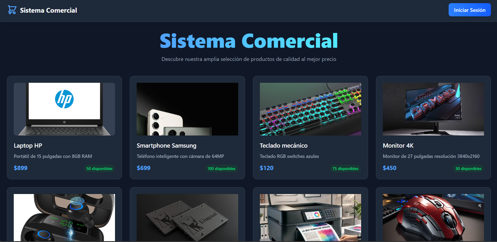

# Desarrollo en proceso🚀

Proyecto frontend desarrollado con React, Vite y Tailwind CSS para construir una aplicación moderna, rápida y escalable orientada al manejo de productos y usaurios.

## Tecnologías utilizadas

- [React 19](https://reactjs.org/)
- [Vite](https://vitejs.dev/) como bundler y servidor de desarrollo
- [Tailwind CSS 4](https://tailwindcss.com/) para estilos utilitarios
- React Router DOM para manejo de rutas
- ESLint para asegurar calidad y estilo en el código

## Scripts disponibles

- `npm run dev`  
  Ejecuta el servidor de desarrollo con recarga en caliente.

- `npm run build`  
  Genera la versión optimizada para producción.

- `npm run preview`  
  Vista previa local de la build de producción.

- `npm run lint`  
  Ejecuta ESLint para revisar errores y advertencias de código.

## Instalación

1. Clonar el repositorio

   ```bash
   git clone https://github.com/SmillRivera14/sistema-comercial.git
   ```

2. Instalar dependencias

   ```bash
   npm install
   ```

3. Ejecutar en modo desarrollo

   ```bash
   npm run dev
   ```

4. Abrir el navegador en [http://localhost:5173](http://localhost:5173) (por defecto)

## Notas
Este es un desarrollo en prograso.

## Capturas de Pantalla

Pantalla principal del sistema:



Vista de la tarjeta principal:


